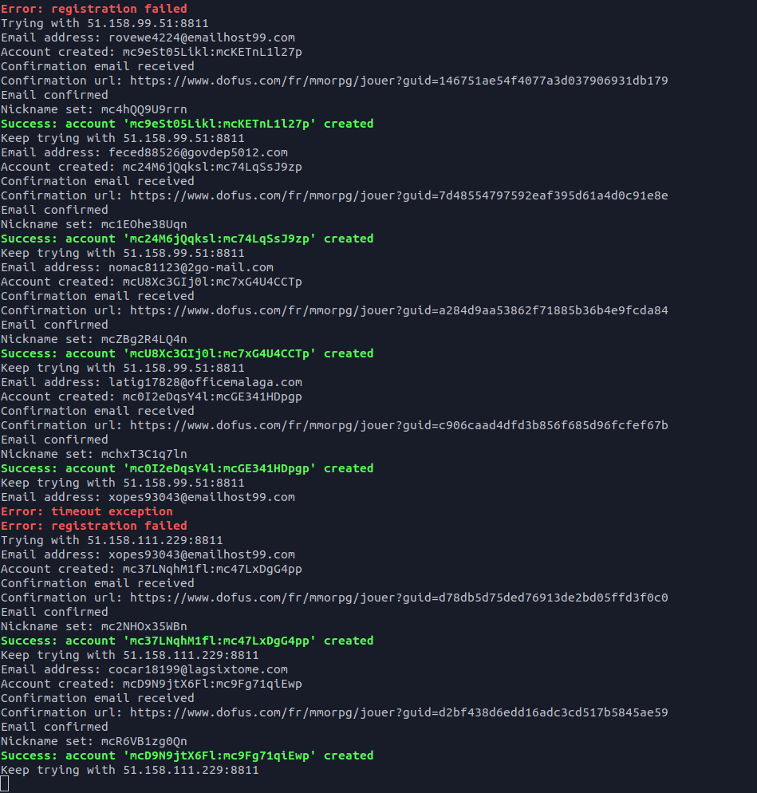

# Dofus Account Generator



## Table of Contents

* [About the Project](#about-the-project)
  * [Built With](#built-with)
* [Getting Started](#getting-started)
  * [Prerequisites](#prerequisites)
  * [Installation](#installation)
* [Options](#options)
* [Usage](#usage)
* [Output](#output)
* [Roadmap](#roadmap)
* [Contributing](#contributing)
* [License](#license)
* [Contact](#contact)
* [Acknowledgements](#acknowledgements)

## About The Project

A simple Ankama account generator working in many different ways:
* By default, without any proxy (maximum 4 accounts per IP)
* With a local proxy list you provide (recommended)
* With random online proxies from the PubProxy API

**Emails are confirmed / 1 email = 1 account**

### Built With

* [Python 3](https://www.python.org/)
* [Selenium](https://selenium-python.readthedocs.io/)

## Getting Started

To get a local copy up and running follow these simple steps.

### Prerequisites

* Python 3 ≥ 3.6
```sh
sudo apt install python3
```
* Pip 3 ≥ 20.0.2
```sh
sudo apt install python3-pip
```
* Firefox ≥ 79
```sh
sudo apt install firefox
```
* xclip ≥ 0.13-1
```sh
sudo apt install xclip
```

### Installation

1. Clone the repo
```sh
git clone https://github.com/AxelConceicao/Dofus-Account-Generator.git
```
2. Run the following command in the repo root to install Python packages
```sh
pip3 install -r requirements.txt
```

## Options

 - `-l` or `--local-proxy` `<file>`: loop proxies in the file you provide
 - `-o` or `--online-proxy`: get a random proxy from the PubProxy API

## Usage

1. No proxy mode (maximum 4 accounts per IP)
```sh
python3 engine.py
```
2. Loop proxies in the file you provide (see `example/proxylist.txt` file)
```sh
python3 engine.py -l example/proxylist.txt
```
3. Get a random proxy from the PubProxy API
```sh
python3 engine.py -o
```
**The program won't stop generating account until keyboardinterrupt (CTRL+C) or the end of the proxy list**

## Output

* `accounts.txt` in the repo root (see `example/accounts.txt` file)
```sh
username:password
mc3wWtmvv76l:mc87Zl7hyjHp
```

## Roadmap

See the [open issues](https://github.com/AxelConceicao/Dofus-Account-Generator/issues) for a list of proposed features (and known issues).

## Contributing

Contributions are what make the open source community such an amazing place to be learn, inspire, and create. Any contributions you make are **greatly appreciated**.

1. Fork the Project
2. Create your Feature Branch (`git checkout -b feature/AmazingFeature`)
3. Commit your Changes (`git commit -m 'Add some AmazingFeature'`)
4. Push to the Branch (`git push origin feature/AmazingFeature`)
5. Open a Pull Request

## License

Distributed under the MIT License. See `LICENSE` for more information.

## Contact

Project Link: [https://github.com/AxelConceicao/Dofus-Account-Generator](https://github.com/AxelConceicao/Dofus-Account-Generator)

## Acknowledgements

* [Selenium](https://selenium-python.readthedocs.io/)
* [Pyperclip](https://pypi.org/project/pyperclip/)
* [Geckodriver](https://github.com/mozilla/geckodriver)